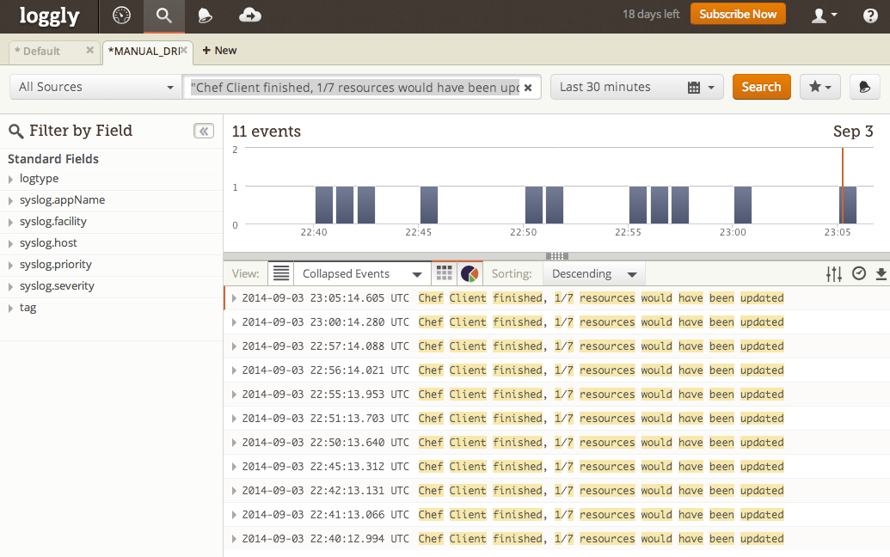

# why-run-alerting cookbook

A few of my customers lately have been inquiring about running the Chef client in a `--why-run (-W)` mode to catch drift on their servers and be alerted from this happening.  Of course, just running `--why-run` wasn't much of the concern but instead how to get notified when `--why-run` found something is key.  So here is a proof of concept app to do this with the help of Loggly, but the theory here can easily apply to other logging tools like Splunk, Papertrail or numerous others.

# TL;DR
The real key to get everything working here is the use of the `--force-formatter` flag on the Chef client run.  Setting this flag was required to get the client messaging like "Chef Client finished, 1/7 resources would have been updated" written in to a log file to then send along to a log monitoring tool.

# Dependencies
* To run this demo yourself, you'll need a [Loggly](www.loggly.com) account and to then set 3 environment variables with `LOGGLY_USERNAME`, `LOGGLY_APPNAME` and `LOGGLY_KEY`.  They are used by the kitchen.yml to be passed in to the VM to automatically install and configure Loggly.
* Secondly, you'll want the [Chef DK](github.com/opscode/chef-dk) installed to have Test Kitchen available.  Otherwise install the necessary tools yourself.
* Third, no Chef Server is required, this all runs in Chef Zero mode to be a self contained example (aside from needing to push the log file to Loggly).

# Setup the testing machine
`kitchen converge`

# And then connect to the box and see what's going on
`kitchen login` 

For realtime analysis you can see what is going on with `tail -f /tmp/why-run.log`  We are sending that log file off to Loggly where the real magic can start happening.

# The Loggly Search + Alerts
Setting up an Alert in Loggly is [described here](https://www.loggly.com/docs/adding-alerts/).  The search term I used to drive my alert is very specific to this use-case "Chef Client finished, 1/7 resources would have been updated".  Then you can be emailed, or PagerDutied or configure other web hooks for when the Chef client reports a Resource "would have been updated".

# The Cron Jobs
With a little FizzBuzz type action here, we're going to run Chef client in `--why-run` mode every minute to check for Drift.
* `chef-client -z --force-formatter -W -c /tmp/kitchen/client.rb >> /tmp/why-run.log 2>&1`
"Chef Client finished, 0/7 resources would have been updated"

Then every 3 minutes we'll insert our Drift
* `echo " Ooowns. Ooowns." >> /tmp/why-run`

Now the `--why-run` output will change to include
"Chef Client finished, 1/7 resources would have been updated"

And finally, every 5 minutes we'll reset the file with a Chef client run
* `chef-client -z --force-formatter -c /tmp/kitchen/client.rb >> /tmp/why-run.log 2>&1`
"Chef Client finished, 1/7 resources updated in 2.768937233 seconds"

Now we'll have drift from the original file about half the time.  Thus the /tmp/why-run file will be in the expected state and the `--why-run` will report all is okay.  The other half of the time `--why-run` will report a managed Resource has changed and this will trigger the Alert from Loggly.